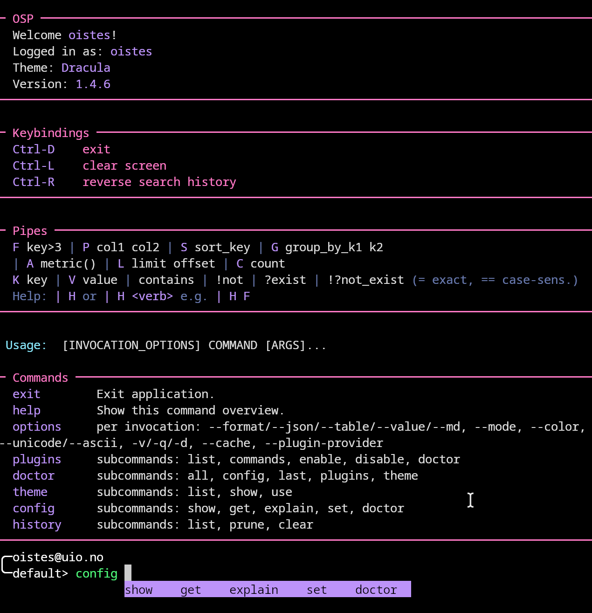

[](https://github.com/unioslo/osp-cli-rs/actions/workflows/verify.yml)
[](https://github.com/unioslo/osp-cli-rs/actions/workflows/release.yml)
[](https://crates.io/crates/osp-cli)
[](https://docs.rs/osp-cli)

# osp-cli


`osp-cli` is a batteries-included Rust CLI and interactive REPL for
structured operational workflows.

It combines:
- command execution
- interactive shell ergonomics
- layered configuration
- multiple render modes and output formats
- a small pipeline DSL
- external command plugins

Use it as:
- a normal command-line tool
- a long-running REPL with history, completion, inline help, and cached
  results

## Install

From crates.io:

```bash
cargo install osp-cli
```

From source:

```bash
cargo install --path .
```

Run it:

```bash
osp --help
osp
```

## Quick Start

CLI:

```bash
osp config show
osp theme list
osp plugins list
```

REPL:

```text
osp> ldap user alice
osp> ldap user alice | P uid cn mail
osp> ldap user alice --cache | V uid
osp> help config
```

Per-invocation flags work the same in the CLI and REPL:

```bash
osp ldap user alice --json
osp ldap user alice --format table -v
```

```text
ldap user alice --json
ldap user alice --format table -v
```

## Capabilities

- CLI and REPL entrypoints with shared command semantics
- history, completion, highlighting, and scoped shells in the REPL
- invocation-local output and debug controls
- output formats including table, JSON, markdown, mreg, and value
- a row-oriented pipeline DSL for filtering, projection, grouping,
  sorting, aggregation, and quick search
- profile-aware config with file, env, secrets, CLI, and REPL-session
  layering
- theming, color policy, unicode policy, and presentation presets
- plugin discovery and dispatch through a JSON subprocess protocol

## Configuration And Output

Default paths:

- config: `~/.config/osp/config.toml`
- secrets: `~/.config/osp/secrets.toml`

Invocation flags such as `--json`, `--format`, `--color`,
`--plugin-provider`, `-v`, `-q`, and `-d` affect only the current
command. They do not mutate stored config.

See:
- [docs/CONFIG.md](docs/CONFIG.md)
- [docs/FORMATTING.md](docs/FORMATTING.md)
- [docs/REPL.md](docs/REPL.md)

## Plugins

`osp-cli` can discover external commands from configured plugin
directories and invoke them through a documented JSON protocol.

See:
- [docs/USING_PLUGINS.md](docs/USING_PLUGINS.md)
- [docs/WRITING_PLUGINS.md](docs/WRITING_PLUGINS.md)
- [docs/PLUGIN_PROTOCOL.md](docs/PLUGIN_PROTOCOL.md)
- [docs/AUTH.md](docs/AUTH.md)

## Documentation

Start with:
- [docs/README.md](docs/README.md)

Core guides:
- [docs/REPL.md](docs/REPL.md)
- [docs/CONFIG.md](docs/CONFIG.md)
- [docs/DSL.md](docs/DSL.md)
- [docs/THEMES.md](docs/THEMES.md)
- [docs/TROUBLESHOOTING.md](docs/TROUBLESHOOTING.md)

## Development

Useful commands:

```bash
./scripts/check-rust-fast.sh
cargo test --all-features --locked
python3 scripts/check-coverage-gate.py --fast
```

See:
- [docs/CONTRIBUTING.md](docs/CONTRIBUTING.md)
- [docs/TESTING.md](docs/TESTING.md)

## License

[GPLv3](LICENSE)
